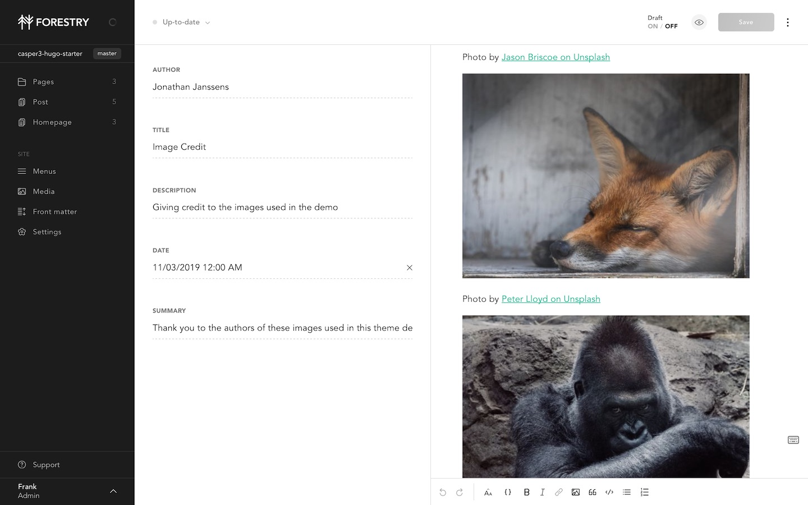

# Casper 3 Hugo Starter for Forestry

[Hugo port of the Casper 3 theme](https://github.com/jonathanjanssens/hugo-casper3) originally by Ghost.

<a href="https://app.forestry.io/quick-start?repo=forestryio/casper3-hugo-starter&engine=hugo&version=0.63.1">
</a>

## Prerequisites

- Hugo > 0.54.0

## Content Management



This project has been pre-configured to work with [Forestry](https://forestry.io), just import your repository ✨. \
Any changes you make will be commited back to the repo, and deployed if you're using Netlify.

## Deployment and hosting with Netlify

Import your site in [Netlify](https://netlify.com)

1. Create a new site in Netlify and import your repository.
2. Set the build command to: `hugo --gc --minify`
3. Set the publish directory to: `public`
4. Make sure to set `HUGO_VERSION` to 0.54.0 or above (tested with 0.63.1)
3. Set the publish directory to: `public`

That's it, now your site gets deployed automatically on `git push` or when saving documents from Forestry.

## Development

```bash
# clone the repository
git clone git@github.com:forestryio/casper3-hugo-starter.git

# cd in the project directory
cd casper3-hugo-starter

# Start local dev server
hugo server
```

For more information, see [official Hugo documentation](https://gohugo.io/getting-started/).
